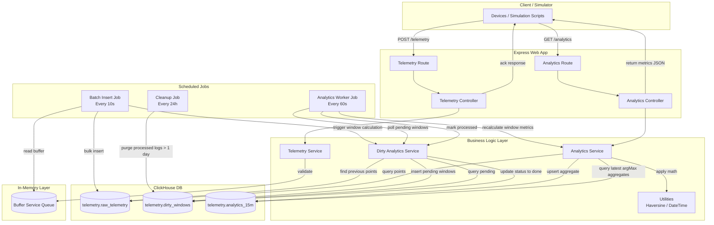

# Project Architecture Documentation

## 1. Overview
- **Project Name:** ClickHouse Telemetry Prototype/Platform
- **Purpose:** A high-throughput vehicle/device telemetry ingestion and processing platform designed to write telemetry records efficiently, identify active sessions, detect gaps, and compute metrics (e.g. speed, distance, stops, engine run times) aggregated in 15-minute windows using ClickHouse.
- **Tech Stack:** Node.js, Express, ClickHouse database, Node ClickHouse client (`@clickhouse/client`), dotenv, and nodemon.

The system is designed to handle high-frequency location data streams by ingestion buffering. Telemetry data sent by tracking devices via HTTP is immediately validation-checked and queued into an in-memory buffer. An asynchronous background scheduler periodically drains this buffer in batches and writes it to a raw telemetry table in ClickHouse. Upon successful insertion, a queue worker flags the affected time windows as "dirty," prompting an aggregator job to compute analytics for those specific windows concurrently and store the results.

---

## 2. Folder Structure
Below is a tree view of the project with a brief description of each folder and key file:

```
clickhouse/
├── scripts/                          → Database management and simulation scripts
│   ├── checkTables.js                → Script that checks active ClickHouse database tables
│   ├── device1.json                  → Sample simulated GPS coordinates trace for Device 1
│   ├── device2.json                  → Sample simulated GPS coordinates trace for Device 2
│   ├── device3.json                  → Sample simulated GPS coordinates trace for Device 3
│   ├── sendTelemetry.js              → Utility to push JSON data to the ingestion HTTP server
│   └── setupDb.js                    → Database migrator that sets up ClickHouse tables
├── src/                              → Primary codebase containing the application logic
│   ├── config/                       → Configuration files and clients
│   │   └── clickhouse.js             → Initializes the connection client for ClickHouse
│   ├── controllers/                  → Presentation layer mapping requests to controllers
│   │   ├── analyticController.js     → Controller handling aggregation metric queries
│   │   └── telemetryController.js    → Controller handling telemetry payload ingestion
│   ├── jobs/                         → Background workers running on periodic loops
│   │   ├── analytics.job.js          → Computes and stores analytical calculations for dirty windows
│   │   ├── batchInsert.job.js        → Batches buffered telemetry into ClickHouse and marks dirty windows
│   │   └── dirtWindowCleanUp.job.js  → Cleans up processed dirty windows logs older than a day
│   ├── routes/                       → URL path matching routing rules
│   │   ├── analytic.js               → Routing for analytics queries
│   │   └── telemetry.js              → Routing for ingestion and buffer statuses
│   ├── services/                     → Business layer containing domain logic
│   │   ├── analyticService.js        → Core analytical calculation engine (engine sessions, stops)
│   │   ├── bufferService.js          → Thread-safe in-memory queue arrays
│   │   ├── dirtyAnalyticsService.js  → Registers and tracks which window bounds need recalculating
│   │   └── telemetryService.js       → Processes and validates raw packet inputs
│   ├── utils/                        → General utility operations
│   │   ├── coerce.js                 → Utility converting inputs into boolean types
│   │   ├── dateTime.js               → Date normalizer and 15-minute window calculations
│   │   └── haversine.js              → Mathematical formula to calculate great-circle distances
│   └── server.js                     → Application bootstrap file starting the HTTP server
├── .env                              → Database and server credentials file
├── .env.example                      → Configuration template file
├── package.json                      → Package scripts and dependency list
└── README.md                         → Setup instruction file
```

---

## 3. Component Breakdown

### server.js
- **Name:** Server Bootstrapper
- **Location:** [src/server.js](file:///C:/Users/Rishi/Downloads/clickhouse/src/server.js)
- **Purpose:** Entry point that loads environment variables, registers routes, bootstraps background worker jobs, and starts the Express server.
- **Depends on:** 
  - [src/jobs/batchInsert.job.js](file:///C:/Users/Rishi/Downloads/clickhouse/src/jobs/batchInsert.job.js)
  - [src/jobs/analytics.job.js](file:///C:/Users/Rishi/Downloads/clickhouse/src/jobs/analytics.job.js)
  - [src/jobs/dirtWindowCleanUp.job.js](file:///C:/Users/Rishi/Downloads/clickhouse/src/jobs/dirtWindowCleanUp.job.js)
  - [src/routes/telemetry.js](file:///C:/Users/Rishi/Downloads/clickhouse/src/routes/telemetry.js)
  - [src/routes/analytic.js](file:///C:/Users/Rishi/Downloads/clickhouse/src/routes/analytic.js)
- **Used by:** Node runtime command (`npm start`, `npm run dev`)

### ClickHouse Config
- **Name:** ClickHouse Client Configuration
- **Location:** [src/config/clickhouse.js](file:///C:/Users/Rishi/Downloads/clickhouse/src/config/clickhouse.js)
- **Purpose:** Instantiates and exports the `@clickhouse/client` database driver setup.
- **Depends on:** Environment variables
- **Used by:** 
  - [src/services/telemetryService.js](file:///C:/Users/Rishi/Downloads/clickhouse/src/services/telemetryService.js)
  - [src/services/dirtyAnalyticsService.js](file:///C:/Users/Rishi/Downloads/clickhouse/src/services/dirtyAnalyticsService.js)
  - [src/services/analyticService.js](file:///C:/Users/Rishi/Downloads/clickhouse/src/services/analyticService.js)
  - [src/jobs/batchInsert.job.js](file:///C:/Users/Rishi/Downloads/clickhouse/src/jobs/batchInsert.job.js)
  - [src/jobs/dirtWindowCleanUp.job.js](file:///C:/Users/Rishi/Downloads/clickhouse/src/jobs/dirtWindowCleanUp.job.js)
  - [scripts/setupDb.js](file:///C:/Users/Rishi/Downloads/clickhouse/scripts/setupDb.js)

### Telemetry Controller
- **Name:** Telemetry API Controller
- **Location:** [src/controllers/telemetryController.js](file:///C:/Users/Rishi/Downloads/clickhouse/src/controllers/telemetryController.js)
- **Purpose:** Connects HTTP requests to ingestion service utilities. Handles single and bulk uploads, and retrieves queue buffer sizes.
- **Depends on:** 
  - [src/services/telemetryService.js](file:///C:/Users/Rishi/Downloads/clickhouse/src/services/telemetryService.js)
  - [src/services/bufferService.js](file:///C:/Users/Rishi/Downloads/clickhouse/src/services/bufferService.js)
- **Used by:** [src/routes/telemetry.js](file:///C:/Users/Rishi/Downloads/clickhouse/src/routes/telemetry.js)
- **Note:** *Contains an import mismatch targeting `telemetryService.getTelemetry` (it imports `{ ingest, ingestBulk }` but references `telemetryService.getTelemetry` on line 63).*

### Analytics Controller
- **Name:** Analytics Query Controller
- **Location:** [src/controllers/analyticController.js](file:///C:/Users/Rishi/Downloads/clickhouse/src/controllers/analyticController.js)
- **Purpose:** Processes search queries for computed metrics and delegates them to the calculation query layers.
- **Depends on:** [src/services/analyticService.js](file:///C:/Users/Rishi/Downloads/clickhouse/src/services/analyticService.js)
- **Used by:** [src/routes/analytic.js](file:///C:/Users/Rishi/Downloads/clickhouse/src/routes/analytic.js)

### Telemetry Service
- **Name:** Telemetry Logic Service
- **Location:** [src/services/telemetryService.js](file:///C:/Users/Rishi/Downloads/clickhouse/src/services/telemetryService.js)
- **Purpose:** Performs input validations on raw payload data (e.g. coordinates, ignition status, speed), converts speeds to km/h, and pushes valid records into the memory buffer.
- **Depends on:** 
  - [src/services/bufferService.js](file:///C:/Users/Rishi/Downloads/clickhouse/src/services/bufferService.js)
  - [src/config/clickhouse.js](file:///C:/Users/Rishi/Downloads/clickhouse/src/config/clickhouse.js)
  - [src/utils/coerce.js](file:///C:/Users/Rishi/Downloads/clickhouse/src/utils/coerce.js)
- **Used by:** [src/controllers/telemetryController.js](file:///C:/Users/Rishi/Downloads/clickhouse/src/controllers/telemetryController.js)

### Buffer Service
- **Name:** In-Memory Ingestion Queue Buffer
- **Location:** [src/services/bufferService.js](file:///C:/Users/Rishi/Downloads/clickhouse/src/services/bufferService.js)
- **Purpose:** Encapsulates an in-memory array to queue ingested packets temporarily, preventing synchronous database write blockages.
- **Depends on:** None
- **Used by:** 
  - [src/controllers/telemetryController.js](file:///C:/Users/Rishi/Downloads/clickhouse/src/controllers/telemetryController.js)
  - [src/services/telemetryService.js](file:///C:/Users/Rishi/Downloads/clickhouse/src/services/telemetryService.js)
  - [src/jobs/batchInsert.job.js](file:///C:/Users/Rishi/Downloads/clickhouse/src/jobs/batchInsert.job.js)

### Dirty Analytics Service
- **Name:** Dirty Windows Tracking Service
- **Location:** [src/services/dirtyAnalyticsService.js](file:///C:/Users/Rishi/Downloads/clickhouse/src/services/dirtyAnalyticsService.js)
- **Purpose:** Decides which 15-minute time frames need recalculation. Reads preceding records to fill gaps between consecutive packet updates and records changes with status flags.
- **Depends on:** 
  - [src/config/clickhouse.js](file:///C:/Users/Rishi/Downloads/clickhouse/src/config/clickhouse.js)
  - [src/utils/dateTime.js](file:///C:/Users/Rishi/Downloads/clickhouse/src/utils/dateTime.js)
- **Used by:** 
  - [src/jobs/batchInsert.job.js](file:///C:/Users/Rishi/Downloads/clickhouse/src/jobs/batchInsert.job.js)
  - [src/jobs/analytics.job.js](file:///C:/Users/Rishi/Downloads/clickhouse/src/jobs/analytics.job.js)

### Analytics Service
- **Name:** Aggregate Analytics Service
- **Location:** [src/services/analyticService.js](file:///C:/Users/Rishi/Downloads/clickhouse/src/services/analyticService.js)
- **Purpose:** Aggregates location points. Computes vehicle parameters such as active ignition duration, idle duration, stops, max/average speeds, and cumulative distances in 15-minute intervals.
- **Depends on:** 
  - [src/config/clickhouse.js](file:///C:/Users/Rishi/Downloads/clickhouse/src/config/clickhouse.js)
  - [src/utils/haversine.js](file:///C:/Users/Rishi/Downloads/clickhouse/src/utils/haversine.js)
  - [src/utils/dateTime.js](file:///C:/Users/Rishi/Downloads/clickhouse/src/utils/dateTime.js)
- **Used by:** 
  - [src/controllers/analyticController.js](file:///C:/Users/Rishi/Downloads/clickhouse/src/controllers/analyticController.js)
  - [src/jobs/analytics.job.js](file:///C:/Users/Rishi/Downloads/clickhouse/src/jobs/analytics.job.js)

### Batch Insertion Job
- **Name:** Ingestion Flush Scheduler
- **Location:** [src/jobs/batchInsert.job.js](file:///C:/Users/Rishi/Downloads/clickhouse/src/jobs/batchInsert.job.js)
- **Purpose:** Periodic job running every 10 seconds that drains the buffer and saves raw telemetries to ClickHouse, then triggers the dirty-window flagging logic.
- **Depends on:** 
  - [src/services/bufferService.js](file:///C:/Users/Rishi/Downloads/clickhouse/src/services/bufferService.js)
  - [src/services/dirtyAnalyticsService.js](file:///C:/Users/Rishi/Downloads/clickhouse/src/services/dirtyAnalyticsService.js)
  - [src/config/clickhouse.js](file:///C:/Users/Rishi/Downloads/clickhouse/src/config/clickhouse.js)
- **Used by:** [src/server.js](file:///C:/Users/Rishi/Downloads/clickhouse/src/server.js)

### Analytics Job
- **Name:** Aggregation Processing Job
- **Location:** [src/jobs/analytics.job.js](file:///C:/Users/Rishi/Downloads/clickhouse/src/jobs/analytics.job.js)
- **Purpose:** Scans the dirty database index on a 1-minute interval, processes pending windows in parallel, updates aggregates, and marks windows as done.
- **Depends on:** 
  - [src/services/analyticService.js](file:///C:/Users/Rishi/Downloads/clickhouse/src/services/analyticService.js)
  - [src/services/dirtyAnalyticsService.js](file:///C:/Users/Rishi/Downloads/clickhouse/src/services/dirtyAnalyticsService.js)
- **Used by:** [src/server.js](file:///C:/Users/Rishi/Downloads/clickhouse/src/server.js)

### Dirty Window Cleanup Job
- **Name:** Dirty Window Cleanup Job
- **Location:** [src/jobs/dirtWindowCleanUp.job.js](file:///C:/Users/Rishi/Downloads/clickhouse/src/jobs/dirtWindowCleanUp.job.js)
- **Purpose:** Daily background job that deletes outdated dirty window tracker records from the database once they are marked as processed and are older than one day.
- **Depends on:** [src/config/clickhouse.js](file:///C:/Users/Rishi/Downloads/clickhouse/src/config/clickhouse.js)
- **Used by:** [src/server.js](file:///C:/Users/Rishi/Downloads/clickhouse/src/server.js)

### Haversine Utility
- **Name:** Haversine Great-Circle Formula Utility
- **Location:** [src/utils/haversine.js](file:///C:/Users/Rishi/Downloads/clickhouse/src/utils/haversine.js)
- **Purpose:** Calculates the distance in kilometers between two GPS coordinates using the Haversine formula.
- **Depends on:** None
- **Used by:** [src/services/analyticService.js](file:///C:/Users/Rishi/Downloads/clickhouse/src/services/analyticService.js)

### Coerce Utility
- **Name:** Coercion Helper Utility
- **Location:** [src/utils/coerce.js](file:///C:/Users/Rishi/Downloads/clickhouse/src/utils/coerce.js)
- **Purpose:** Helper that normalizes parameters to boolean types.
- **Depends on:** None
- **Used by:** [src/services/telemetryService.js](file:///C:/Users/Rishi/Downloads/clickhouse/src/services/telemetryService.js)

### Date Time Utility
- **Name:** DateTime Helper Utility
- **Location:** [src/utils/dateTime.js](file:///C:/Users/Rishi/Downloads/clickhouse/src/utils/dateTime.js)
- **Purpose:** Helps normalize Date objects, check chronology, and align timestamps to 15-minute window bounds.
- **Depends on:** None
- **Used by:** 
  - [src/services/dirtyAnalyticsService.js](file:///C:/Users/Rishi/Downloads/clickhouse/src/services/dirtyAnalyticsService.js)
  - [src/services/analyticService.js](file:///C:/Users/Rishi/Downloads/clickhouse/src/services/analyticService.js)

### Setup Database Script
- **Name:** ClickHouse DB Setup Bootstrapper
- **Location:** [scripts/setupDb.js](file:///C:/Users/Rishi/Downloads/clickhouse/scripts/setupDb.js)
- **Purpose:** Bootstrapping database scripts that create `telemetry` database, raw tables, ReplacingMergeTree analytics tables, and ReplacingMergeTree dirty windows tables.
- **Depends on:** [src/config/clickhouse.js](file:///C:/Users/Rishi/Downloads/clickhouse/src/config/clickhouse.js)
- **Used by:** Direct execution (`npm run db:setup`)

---

## 4. Architecture Diagram
The system structure, data paths, and background processing architecture are shown below:



---

## 5. Data Flow Explanation

### Ingestion Data Flow
1. **Request:** A GPS device posts location coordinates to `/telemetry` or `/telemetry/bulk`.
2. **Validation:** [telemetryController.js](file:///C:/Users/Rishi/Downloads/clickhouse/src/controllers/telemetryController.js) invokes [telemetryService.js](file:///C:/Users/Rishi/Downloads/clickhouse/src/services/telemetryService.js). The service validates input domains (ranges, dates, structures) and standardizes parameters.
3. **Queueing:** Valued records are pushed into the local array inside [bufferService.js](file:///C:/Users/Rishi/Downloads/clickhouse/src/services/bufferService.js).
4. **Response:** An HTTP acknowledgment is sent back to the sender immediately.

### Asynchronous Write & Dirty-Window Queueing
1. **Trigger:** [batchInsert.job.js](file:///C:/Users/Rishi/Downloads/clickhouse/src/jobs/batchInsert.job.js) runs.
2. **Flush:** Records are drained from [bufferService.js](file:///C:/Users/Rishi/Downloads/clickhouse/src/services/bufferService.js) and written using a bulk HTTP insert to the `telemetry.raw_telemetry` table in ClickHouse.
3. **Preceding Search:** [dirtyAnalyticsService.js](file:///C:/Users/Rishi/Downloads/clickhouse/src/services/dirtyAnalyticsService.js) searches `telemetry.raw_telemetry` for the last known location of each device to identify gaps.
4. **Flagging:** The service computes 15-minute bounds enclosing these dates and inserts tracker items into the `telemetry.dirty_windows` queue table with a state of `pending`.

### Metrics Aggregation
1. **Trigger:** [analytics.job.js](file:///C:/Users/Rishi/Downloads/clickhouse/src/jobs/analytics.job.js) runs.
2. **Scanning:** Fetches pending rows from `telemetry.dirty_windows`.
3. **Computation:** Initiates parallel worker routines calling [analyticService.js](file:///C:/Users/Rishi/Downloads/clickhouse/src/services/analyticService.js) to:
   - Query points within the target time segment from `telemetry.raw_telemetry`.
   - Calculate cumulative distance (using great-circle maths in [haversine.js](file:///C:/Users/Rishi/Downloads/clickhouse/src/utils/haversine.js)).
   - Analyze engine states (idle vs. running vs. stopped) and compute durations.
4. **Storage:** Saves the computed metrics into `telemetry.analytics_15m` in ClickHouse.
5. **Marking Processed:** Pushes a version increment row indicating the window is `done` into `telemetry.dirty_windows`.

### Analytics Retrieval
1. **Request:** A user queries `GET /analytics?deviceId=X&from=Y&to=Z`.
2. **Execution:** [analyticController.js](file:///C:/Users/Rishi/Downloads/clickhouse/src/controllers/analyticController.js) routes the query to `getAnalytics` in [analyticService.js](file:///C:/Users/Rishi/Downloads/clickhouse/src/services/analyticService.js).
3. **Aggregation Query:** Executes an `argMax(column, updatedAt)` grouping query over `telemetry.analytics_15m` to ensure the latest calculation version is returned.

---

## 6. External Dependencies & Integrations

### Database Integration
- **ClickHouse:** A column-oriented database optimized for real-time analytical queries. The system connects using the official `@clickhouse/client` library.
  - **`telemetry.raw_telemetry`** uses the standard `MergeTree` engine, ordered by `(deviceId, timestamp)`.
  - **`telemetry.analytics_15m`** uses the `ReplacingMergeTree` engine, using `updatedAt` to collapse duplicate 15-minute calculations during merge operations.
  - **`telemetry.dirty_windows`** uses the `ReplacingMergeTree` engine, using the `version` field to track status transitions (`pending` vs. `done`).

### Key Libraries
- **`express`:** Routing framework for handling API endpoints.
- **`dotenv`:** Parses variables from `.env` to configure ports and database connection configurations.
- **`nodemon`:** Utility used in development to reload the server process automatically on file saves.

---

## 7. Entry Points

### Application Bootstrapping
- **Main File:** [src/server.js](file:///C:/Users/Rishi/Downloads/clickhouse/src/server.js)
- **Startup Process:**
  1. Loads configuration from `.env` via `dotenv`.
  2. Runs background scheduled tasks (`setInterval` timers in [batchInsert.job.js](file:///C:/Users/Rishi/Downloads/clickhouse/src/jobs/batchInsert.job.js), [analytics.job.js](file:///C:/Users/Rishi/Downloads/clickhouse/src/jobs/analytics.job.js), and [dirtWindowCleanUp.job.js](file:///C:/Users/Rishi/Downloads/clickhouse/src/jobs/dirtWindowCleanUp.job.js)).
  3. Registers HTTP JSON endpoints.
  4. Starts the API server listening on the configured `PORT` (default: 3000).

### Schema Creation
- **Setup File:** [scripts/setupDb.js](file:///C:/Users/Rishi/Downloads/clickhouse/scripts/setupDb.js)
- **Purpose:** Executed using `npm run db:setup` to establish the `telemetry` database schema and create the tables if they do not exist.

---

## 8. Design Patterns Used

- **Asynchronous Processing Queue (In-Memory Buffer):** Enables high-performance, non-blocking writes by decoupling incoming HTTP requests from database writes.
- **ReplacingMergeTree / Versioned Queue Pattern:** Uses ClickHouse's `ReplacingMergeTree` engine and `argMax` aggregation functions to model an updateable state queue on top of an append-only database.
- **Service Layer (Domain Facade):** Business logic is decoupled from routes and controllers and encapsulated in dedicated service modules (e.g. `telemetryService`, `analyticService`, `dirtyAnalyticsService`).
- **Singleton Client Pattern:** The ClickHouse client instance is created once in [clickhouse.js](file:///C:/Users/Rishi/Downloads/clickhouse/src/config/clickhouse.js) and shared across all database queries.
